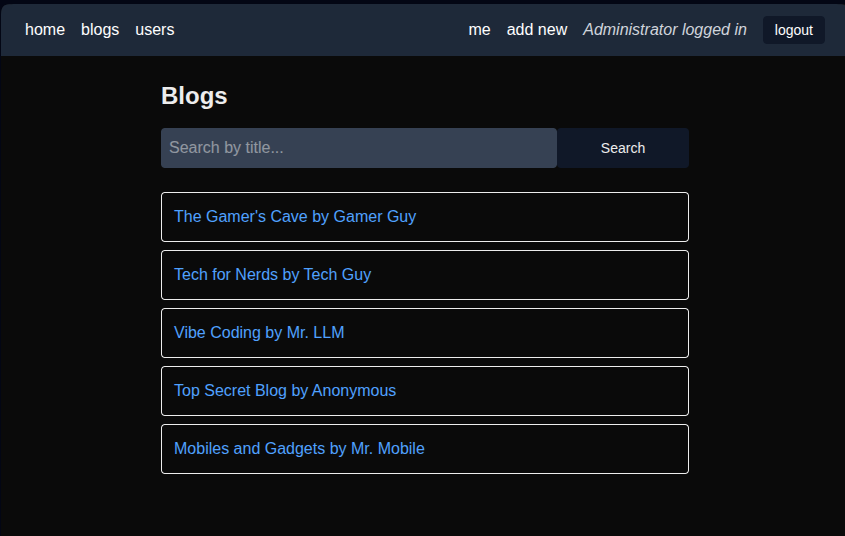
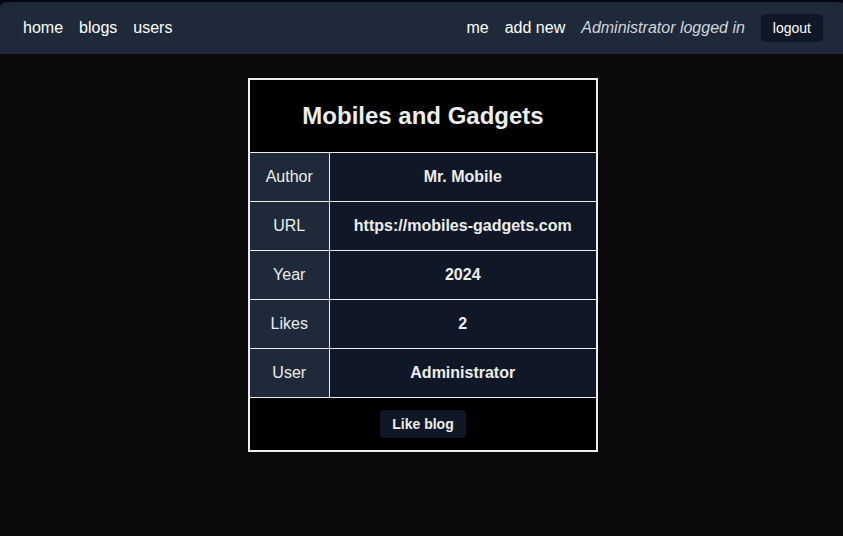
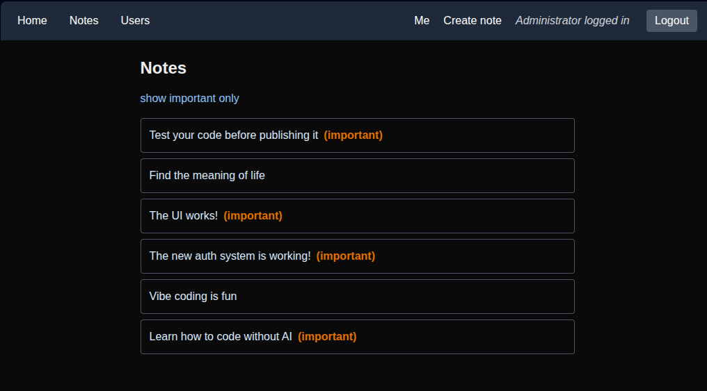

# FullStackOpen - Next.js

## Table of Contents
- [Blogs List](#blogs-list)
- [Notes app](#notes-app)


## Blogs List

### Screenshots

<div style="display: flex; gap: 1rem;">
  
  
</div>

### Setup

- Generate a secret key to sign the JWT session tokens
  ```bash
  echo "$(openssl rand -base64 32)"
  ```

- Create an `.env.local` file on the root of your project, add a Neon DB url
  ```conf
  DATABASE_URL="postgresql://<username>:<password>@<hostname>/neondb?channel_binding=require&sslmode=require"
  AUTH_SECRET=your_secret_auth_token
  ```

- Install dependencies
  ```bash
  cd ./blogs-list && npm install
  ```

- Run migrations
  ```bash
  npx drizzle-kit migrate
  ```

### Usage

#### Development mode

- Start the app (supports hot reloading)
  ```bash
  npm run dev
  ```

- Web UI on http://localhost:3000

#### Production mode

- Build the app
  ```bash
  npm run build
  ```

- Start it
  ```bash
  npm run start
  ```

- Web UI on http://localhost:3000

#### Database access

- Drizzle Studio UI
  ```bash
  npx drizzle-kit studio
  ```

- Access on https://local.drizzle.studio


### API Requests

#### GET

Fetch all available notes
```bash
curl -X GET http://localhost:3000/api/blogs
```

#### POST

Add a new note

1. Login on the Web UI: http://localhost:3000/login

2. Access your Personal info page: http://localhost:3000/me

3. Click on "**Generate New Token**"

4. **Copy** your auth token

5. Send a POST request with the blog data and your auth token (example)
    ```bash
    curl -X POST http://localhost:3000/api/blogs  \
      -H "Authorization: Bearer <token>" \
      -H "Content-Type: application/json" \
      -d '{ "title": "My personal blog space", "author": "Myself", "url": "http://example.com", "year": 2026 }'
    ```


## Notes app

### Screenshots



### Setup

- Generate a secret key to sign the JWT session tokens
  ```bash
  echo "$(openssl rand -base64 32)"
  ```

- Create an `.env.local` file on the root of your project, add a Neon DB url
  ```conf
  DATABASE_URL="postgresql://<username>:<password>@<hostname>/neondb?channel_binding=require&sslmode=require"
  AUTH_SECRET=your_secret_auth_token
  ```  

- Install dependencies
  ```bash
  cd ./notes-app && npm install
  ```

- Run migrations
  ```bash
  npx drizzle-kit migrate
  ```

### Usage

#### Development mode

- Start the app (supports hot reloading)
  ```bash
  npm run dev
  ```

- Web UI on http://localhost:3000

#### Production mode

- Build the app
  ```bash
  npm run build
  ```

- Start it
  ```bash
  npm run start
  ```

- Web UI on http://localhost:3000

#### Database access

- Drizzle Studio UI
  ```bash
  npx drizzle-kit studio
  ```

- Access on https://local.drizzle.studio


### API Requests

#### GET

Fetch all available notes
```bash
curl -X GET http://localhost:3000/api/notes
```

#### POST

Add a new note

1. Login on the Web UI: http://localhost:3000/login

2. Access your Personal info page: http://localhost:3000/me

3. Click on "**Generate New Token**"

4. **Copy** your auth token

5. Send a POST request with your note's data and your auth token (example)
    ```bash
    curl -X POST http://localhost:3000/api/notes  \
      -H "Authorization: Bearer <token>" \
      -H "Content-Type: application/json" \
      -d '{ "content": "My first note", "important": true }'
    ```
