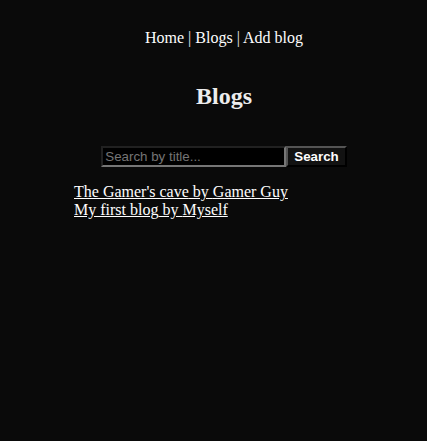
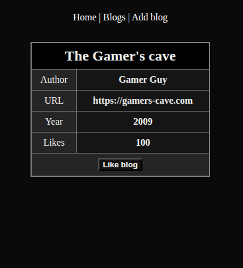

# FullStackOpen - Next.js

## Table of Contents
- [Blogs List](#blogs-list)
- [Notes app](#notes-app)


## Blogs List

### Screenshots




### Setup

- Install dependencies
  ```bash
  cd ./blogs-list && npm install
  ```

### Usage

#### Development mode

- Start the app (supports hot reloading)
  ```bash
  npm run dev
  ```

- Web UI on http://localhost:3000

#### Production mode

- Build the app
  ```bash
  npm run build
  ```

- Start it
  ```bash
  npm run start
  ```

- Web UI on http://localhost:3000


## Notes app

### Setup

- Install dependencies
  ```bash
  cd ./notes-app && npm install
  ```

### Usage

#### Development mode

- Start the app (supports hot reloading)
  ```bash
  npm run dev
  ```

- Web UI on http://localhost:3000

#### Production mode

- Build the app
  ```bash
  npm run build
  ```

- Start it
  ```bash
  npm run start
  ```

- Web UI on http://localhost:3000
